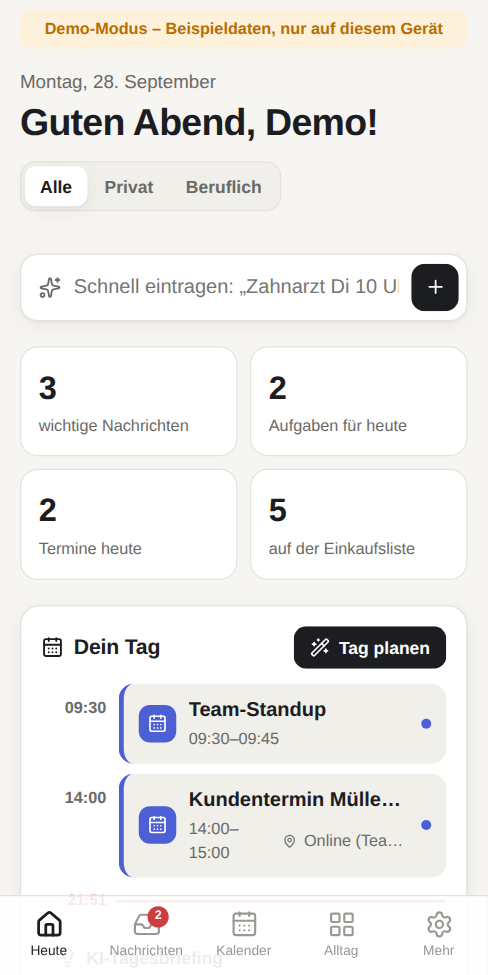
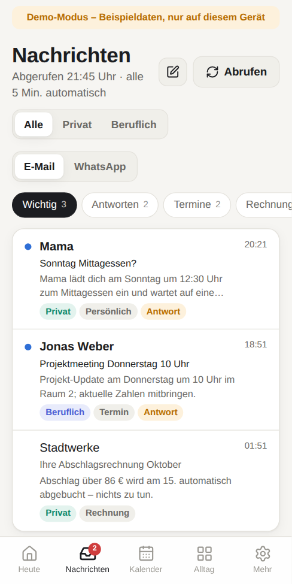
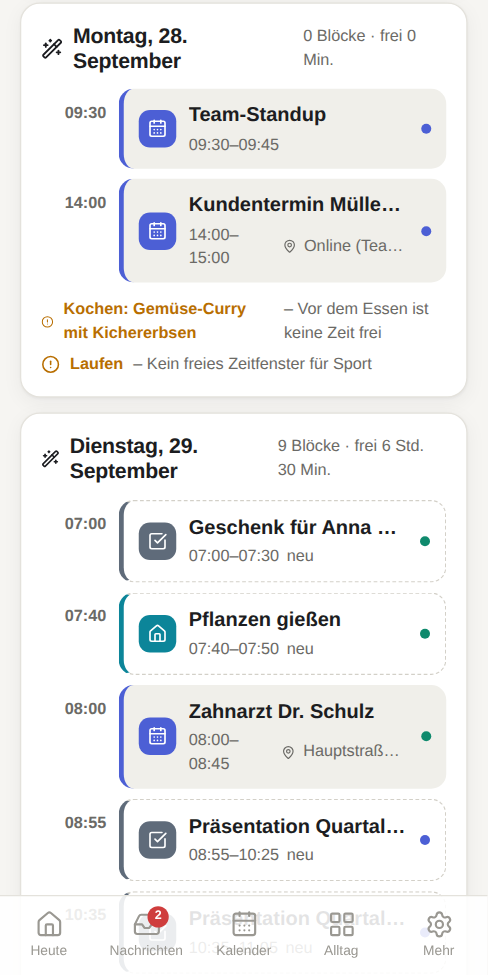
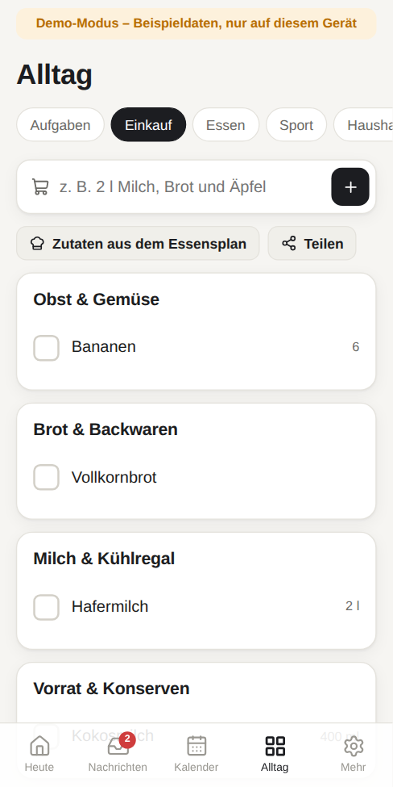

# Manager – privat & beruflich an einem Ort

Deine persönliche App für E-Mails, WhatsApp, Kalender, Aufgaben, Haushalt, Sport, Essen und Einkauf.
Sie läuft auf dem iPhone und auf dem Laptop, zeigt überall dieselben Daten und plant deinen Tag so, dass
Wichtiges rechtzeitig erledigt wird und trotzdem Freizeit bleibt.

| Heute | Nachrichten | Planen | Einkauf |
| --- | --- | --- | --- |
|  |  |  |  |

## Was die App kann

**Privat und beruflich getrennt** – oben in jeder Ansicht umschalten: *Alle · Privat · Beruflich*.

**E-Mails (T-Online, GMX, WEB.DE, iCloud, Gmail)**
- Holt alle 5 Minuten neue Mails aus deinen Postfächern.
- Die KI sortiert jede Mail: privat/beruflich, Kategorie (persönlich, Termin, Rechnung, Bestellung, Amt …),
  Wichtigkeit, „Antwort erwartet“, kurze Zusammenfassung und nächster Schritt.
- Termine aus Mails landen automatisch im Kalender, Aufgaben (z. B. „Rechnung bis 15.10. bezahlen“) in deiner Aufgabenliste.
- Newsletter & Werbung: mit einem Tipp löschen oder abbestellen – auf Wunsch vollautomatisch (landen im Papierkorb, also wiederherstellbar).
- Antworten mit KI entwerfen (berücksichtigt deine freien Zeiten) und direkt senden oder in Apple Mail öffnen.
- Was du in Apple Mail liest oder löschst, wird in der App mit abgeglichen.

**WhatsApp**
- Chat exportieren → in der App importieren → die KI fasst ihn zusammen, zeigt offene Fragen,
  übernimmt To-dos und Termine und schlägt eine Antwort vor.
- Beim nächsten Export werden nur neue Nachrichten ergänzt.

**Kalender (iPhone/iCloud)**
- Termine aus der App werden direkt in deinen iPhone-Kalender geschrieben (privat und beruflich in unterschiedliche Kalender).
- Deine iPhone-Termine erscheinen in der App und werden beim Planen berücksichtigt.
- Tag-, Wochen- und Listenansicht; Alternative ohne iCloud: Kalender-Abo-Link.

**Alltag**
- Aufgaben mit Wichtigkeit, Dauer und Frist.
- Einkaufsliste nach Supermarkt-Bereichen sortiert, mit Mengen, zum Teilen – und Zutaten direkt aus dem Essensplan.
- Essensplan für die Woche mit Rezepten; „Woche planen“ lässt die KI Gerichte samt Einkaufsliste vorschlagen.
- Sportplan mit festen Tagen, Abhaken und Wochenfortschritt; auf Wunsch von der KI erstellt.
- Haushaltsplan mit wiederkehrenden Aufgaben (alle X Tage), die automatisch fällig werden.

**Planen (Zeitmanagement)**
- „Tag planen“ verteilt Aufgaben, Sport, Kochen, Haushalt und Einkauf auf deine freien Zeiten – für heute, morgen oder 7 Tage.
- Berufliches in die Arbeitszeit, Privates davor oder danach, Kochen rechtzeitig vor dem Abendessen, Sport zur Wunsch-Tageszeit.
- Dringendes zuerst; lange Aufgaben werden in Blöcke geteilt; nicht Dringendes kommt an Tage mit mehr Luft –
  pro Tag nur ein begrenztes Budget, damit Freizeit bleibt.
- Mit einem Tipp übernehmen → steht im iPhone-Kalender. Optional: KI-Tagesbriefing mit Tipps.

**Schnell eintragen** – einfach tippen: „Zahnarzt Dienstag 10 Uhr“, „Milch und Brot kaufen“, „Steuer bis Freitag“.

## Einrichtung

### 1. Server (Supabase)
Die App speichert deine Daten in einem eigenen Supabase-Projekt in der EU (Rechenzentrum Irland). Einmalige Schritte (erledigt Claude für dich):
1. Datenbank-Migrationen aus `supabase/migrations/` einspielen.
2. Die Server-Funktionen aus `supabase/functions/` bereitstellen (alle mit `verify_jwt = false`, sie prüfen die Anmeldung selbst).
3. Die Projekt-URL für die automatischen Abrufe im Tresor hinterlegen:
   ```sql
   select vault.create_secret('https://<projekt>.supabase.co', 'project_url');
   ```
4. In `app/.env.production` die Werte `VITE_SUPABASE_URL` und `VITE_SUPABASE_PUBLISHABLE_KEY` eintragen (beide sind öffentlich – die Daten schützt Row Level Security).

### 2. App veröffentlichen (GitHub Pages)
Einmalig im GitHub-Repository: **Settings → Pages → Build and deployment → Source: „GitHub Actions“**.
Danach baut GitHub die App bei jeder Änderung neu. Adresse: `https://<benutzername>.github.io/Manager-/`

Solange kein Server eingetragen ist, startet die App im **Demo-Modus** mit Beispieldaten.

### 3. Konto anlegen
Die Datenbank erzeugt beim Einrichten einen **Einrichtungscode** (Format `XXXX-XXXX-XXXX`). Er steht nur im Tresor:
```sql
select decrypted_secret from vault.decrypted_secrets where name = 'setup_code';
```
Die Adresse mit dem Code öffnen – `https://<benutzername>.github.io/Manager-/?code=XXXX-XXXX-XXXX` – und „Konto anlegen“ ausfüllen
(der Code lässt sich auch von Hand eintippen). Danach ist die Registrierung geschlossen: Außer dir kann sich niemand ein Konto anlegen.

### 4. Auf iPhone und Laptop installieren
- **iPhone:** In Safari öffnen → Teilen-Symbol → „Zum Home-Bildschirm“.
- **Laptop:** In Chrome/Edge in der Adressleiste „App installieren“, in Safari (Mac) „Ablage → Zum Dock hinzufügen“.

### 5. Postfächer verbinden (Einstellungen → E-Mail-Postfächer)
| Anbieter | Was du brauchst |
| --- | --- |
| T-Online | Das **E-Mail-Passwort** aus dem Telekom Kundencenter (nicht das Login-Passwort). |
| GMX / WEB.DE | Im Webmailer einmalig **„POP3 und IMAP Zugriff erlauben“** einschalten; mit Zwei-Faktor-Anmeldung ein Anwendungspasswort. |
| iCloud (Apple Mail) | Ein **app-spezifisches Passwort** von account.apple.com. Senden läuft über „In Mail öffnen“ (Apple erlaubt nur Port 587, den der Server nicht nutzen darf). |
| Gmail | Ein **App-Passwort** (Google-Konto → Sicherheit). |

### 6. iPhone-Kalender verbinden (Einstellungen → iPhone-Kalender)
Apple-ID und ein **app-spezifisches Passwort** eintragen → „Kalender suchen“ → auswählen, welche Kalender angezeigt werden,
welche beruflich sind und wohin neue private/berufliche Termine geschrieben werden.

### 7. KI einschalten (Einstellungen → KI)
Die KI-Funktionen nutzen Claude von Anthropic mit deinem eigenen Schlüssel:
console.anthropic.com → Konto anlegen → unter „Billing“ Guthaben aufladen → unter „API Keys“ einen Schlüssel erstellen → in der App einfügen.
Ohne Schlüssel funktioniert alles außer den KI-Funktionen (Newsletter werden dann nur markiert, nicht automatisch gelöscht).

### 8. WhatsApp-Chats importieren
In WhatsApp den Chat öffnen → auf den Namen tippen → „Chat exportieren“ → „Ohne Medien“ → „In Dateien sichern“.
In der App: Nachrichten → WhatsApp → „Chat importieren“.

## Kosten
- **Supabase:** Das eigene Projekt kostet im Pro-Plan etwa 10 $ pro Monat zusätzlich.
- **Claude (KI):** nach Verbrauch. Standard ist Claude Opus 5.5 (beste Qualität). Grobe Richtwerte bei ~50 Mails am Tag:
  Sortieren mit Opus 5.5 ca. 15–20 $/Monat, mit Haiku 4.5 ca. 3–5 $/Monat. Modelle und laufende Kosten siehst du unter Einstellungen → KI.
- **GitHub Pages:** kostenlos.

## Datenschutz & Sicherheit
- Alle Daten liegen in deinem eigenen Supabase-Projekt (Rechenzentrum Irland, EU). Jede Tabelle ist per Row Level Security nur für dein Konto lesbar.
- Passwörter und der KI-Schlüssel liegen verschlüsselt im Supabase-Tresor (Vault). Die App kann sie speichern, aber nie wieder auslesen –
  nur die Server-Funktionen verwenden sie beim Abrufen.
- Ein Konto entsteht nur über die App mit dem Einrichtungscode; die Datenbank weist jede andere Registrierung ab.
  Nach dem ersten Konto ist die Registrierung ganz gesperrt.
- Mailinhalte werden zur Auswertung an Claude geschickt (nur wenn du einen Schlüssel hinterlegst). Die KI bekommt die Anweisung, Inhalte
  nur als Daten zu behandeln – Befehle in Mails werden nicht befolgt. Automatisch gelöscht wird nur, was die Mail selbst als Massenversand
  kennzeichnet (Kopfzeilen wie `List-Unsubscribe`) **und** was die KI als Newsletter/Werbung einstuft.

## Ehrliche Grenzen
- **WhatsApp:** Für private Nummern gibt es keinen offiziellen Weg, Chats automatisch mitzulesen. Inoffizielle Programme verstoßen gegen
  die Nutzungsbedingungen und riskieren eine Sperre deiner Nummer – deshalb der Import über den Chat-Export.
- **Outlook/Microsoft 365** (z. B. Firmenmail) braucht eine Microsoft-Anmeldung (OAuth) und ist noch nicht eingebaut.
- **iCloud-Mail** kann aus der App nicht direkt senden – Antworten öffnen sich fertig ausgefüllt in Apple Mail.
- Termine, die aus deinem iPhone-Kalender kommen, änderst du dort; Termine aus der App kannst du überall ändern.

## Technik

```
app/                  PWA (React, TypeScript, Vite) – läuft komplett im Browser, Hosting auf GitHub Pages
  src/lib/planner.ts  Planungs-Algorithmus (ohne KI, mit Tests)
  src/lib/whatsapp.ts WhatsApp-Export lesen (iPhone/Android, ZIP)
  src/lib/demo.ts     Demo-Modus mit Beispieldaten im Browser
supabase/
  migrations/         Tabellen, Row Level Security, Tresor-Funktionen, Zeitpläne (pg_cron)
  functions/          Edge Functions (Deno):
    mail-sync         IMAP-Abruf alle 5 Min., KI-Sortierung, Automatik
    mail-action       Postfach testen/speichern, senden (SMTP 465), löschen, abbestellen
    ai                Antwortentwurf, Chat-Zusammenfassung, Schnell-Erfassen, Essens-/Sportplan, Tagesbriefing
    calendar-sync     iCloud/CalDAV: Kalender finden, Termine lesen und schreiben (alle 15 Min.)
    calendar-feed     ICS-Kalender-Abo
    register          einziges Konto anlegen
scripts/test-db.sh    Migrationen + Sicherheitsregeln gegen ein lokales Postgres testen
```

**Entwickeln**
```bash
cd app && npm install && npm run dev      # ohne .env.local startet der Demo-Modus
npm test                                  # Planer, WhatsApp-Import, Einkaufsliste, Schnell-Erfassen
cd supabase/functions && deno test -A _shared/shared_test.ts && deno check */index.ts
PGHOST=… scripts/test-db.sh               # Datenbank-Tests
```

Die KI-Aufrufe nutzen das offizielle Anthropic-SDK mit strukturierten Antworten (JSON-Schema) und serverseitigem Fallback
bei Ablehnungen (`fallbacks: "default"`). Der Server-Schlüssel kann alternativ als Edge-Function-Secret `ANTHROPIC_API_KEY` gesetzt werden.
